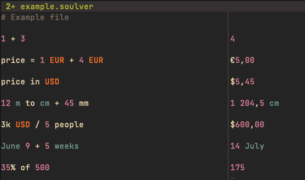

# soulver3.vim

soulver3.vim lets you use vim / neovim as a front end to [Soulver 3](https://soulver.app/)

# Screenshot




# Installation

1. Install Soulver from the official [website](https://soulver.app/)

2. Check if you have the CLI binary of Soulver, by default it's at: \
**/Applications/Soulver\ 3.app/Contents/MacOS/CLI/soulver**

If you don't find there or somewhere on your system follow [this guide to install it](https://documentation.soulver.app/documentation/command-line-tool-automator-and-services)

3. Install **soulver3.vim** with your favorite plugin manager

```vim
Plug 'Yohannfra/soulver3.vim'
```

# Config

If your CLI binary of Soulver is not in the default location, you can change it with:
```vim
let g:soulver_cli_path = "path/to/your/soulver/cli"
```

# Usage

1. Create a file with the **.soulver** extension and type in all the things you would usually with the regular Soulver app
2. call **:Soulver** to show the result of what you wrote

# Acknowledgments

Thanks to the Soulver team for providing a CLI :)
